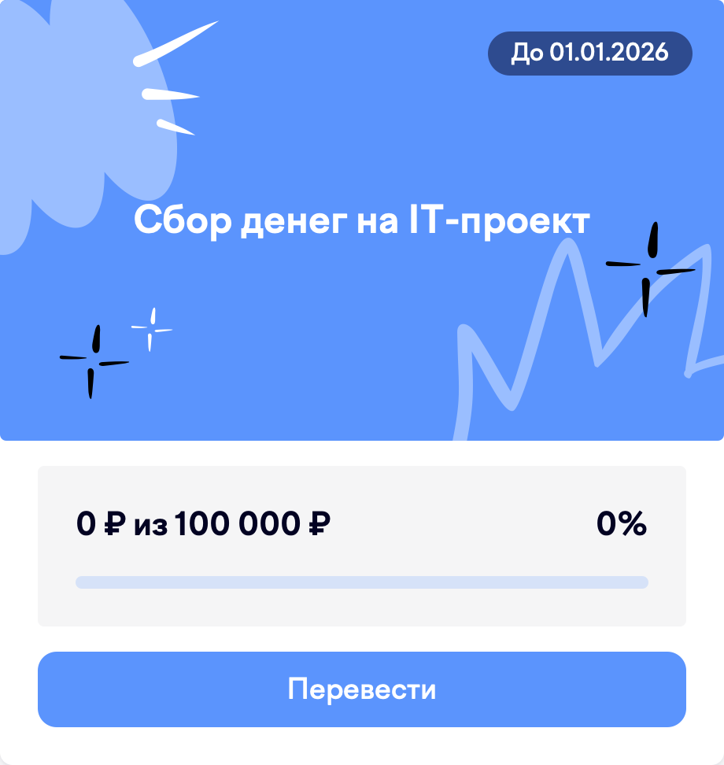

  

## 📓📝 About Me

### English

- My name is **Sull**, and I am a passionate programmer constantly seeking new knowledge and skills.
- The main focus of my studies is on the Python and JavaScript programming languages.
- I also actively use tools like Git and Bash for project management and task automation.
- Additionally, I have experience working with Blender, creating 3D models.
- **I look forward to new connections!**

### Русский

- Меня зовут **Сулл**, и я увлечённый программист, постоянно стремящийся к новым знаниям и навыкам.
- Основное направление моих исследований — языки программирования **Python и JavaScript**.
- Я также активно использую такие инструменты, как **Git и Bash** для управления проектами и автоматизации задач.
- Кроме того, я имею опыт работы с Blender, создавая **3D-модели**.
- **Буду рад новым знакомствам!**

## 🛠️ My Skill Set

### Operating Systems

    

### Version Control

  

### Python Technologies

   

### Frontend Technologies

      

### IDEs

     

### Database

  

### Desktop Development

 

### Other

## 📊 My GitHub Statistics

---

  
### 🔗 Connect with me

  

